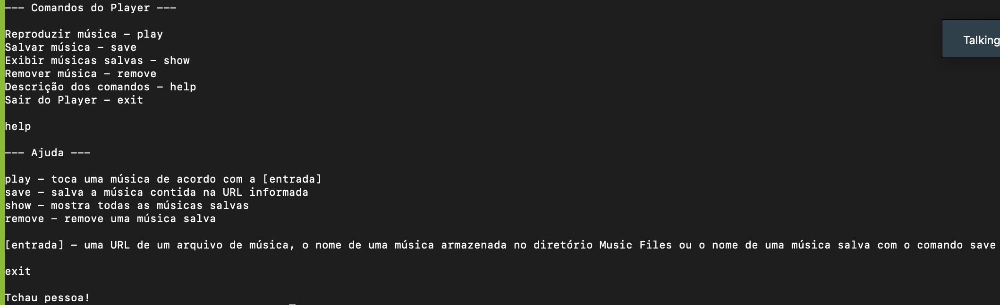
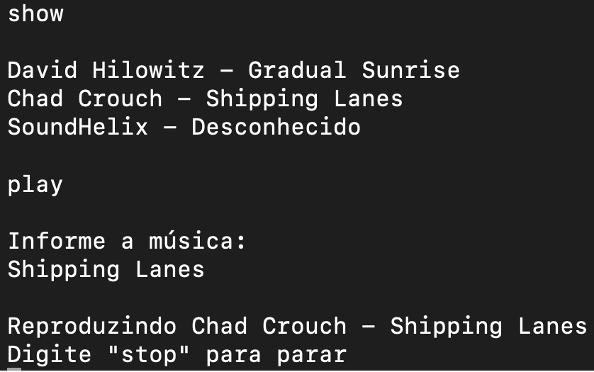
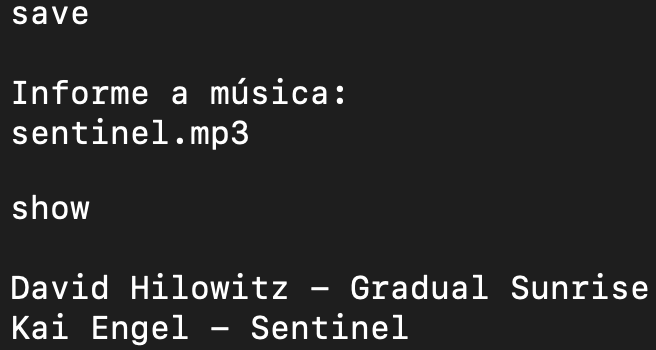
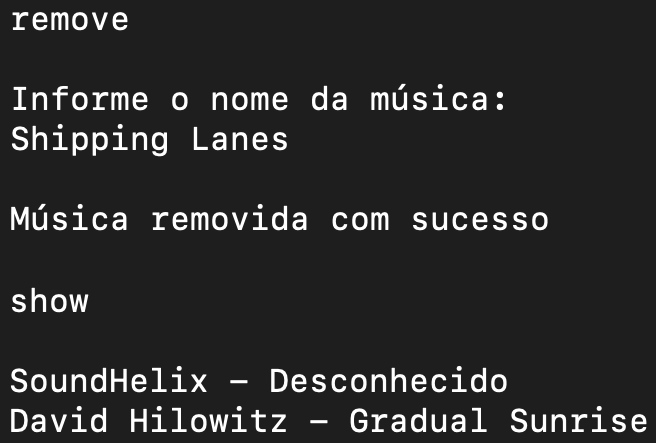
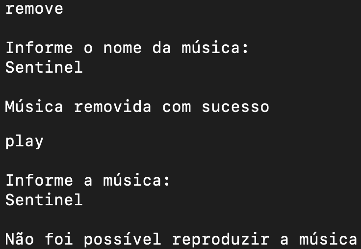

# Terminal Music Player

Reprodutor de musicas no terminal. Podem ser reproduzidas músicas armazenadas localmente ou algum arquivo de musica externo (por meio da url). Também é possível armazenar a referencia dessas musicas,  para facilitar a reprodução.

## Capturas de tela do terminal

